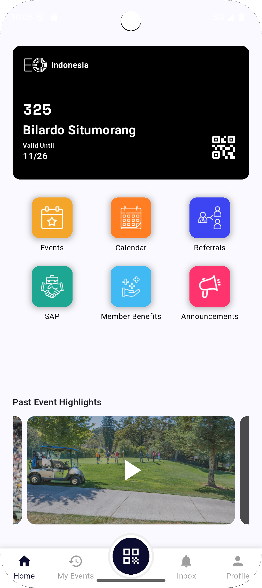
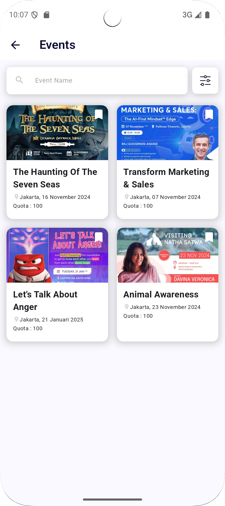
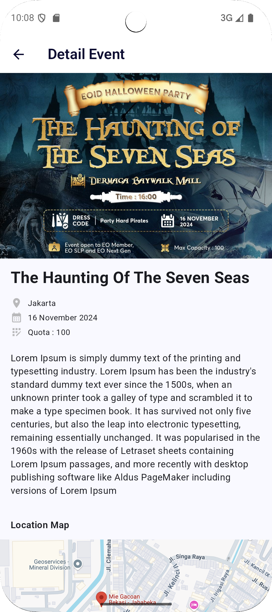

# Event Application - Flutter

This application for showing all of event and user can book any of event that have been listed, 
and can scan qrcode of the event when user attend the event.

## 🚀 Fitur
- 📦 List Event
- 💰 Event Detail
- 💰 Book Event
- 💰 Event video player

## 📸 Screenshot

    
    
    

## 🔧 Instalasi
1. Clone repo: